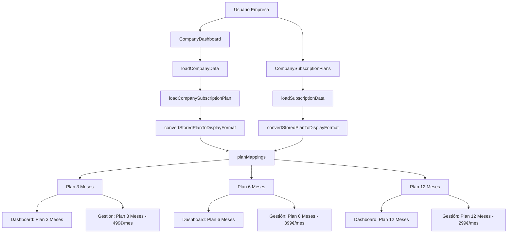

# Sincronización de Plan de Suscripción en Dashboard de Empresa

## 📋 Problema Identificado

El dashboard de empresa mostraba siempre "Plan 12 meses" por defecto, independientemente del plan real seleccionado por la empresa durante el registro con Stripe. Esto causaba inconsistencia entre lo que se mostraba en el dashboard y lo que aparecía en la pantalla de "Gestionar Suscripción".

## 🎯 Solución Implementada

Se ha sincronizado el CompanyDashboard con la misma lógica de detección de planes implementada en CompanySubscriptionPlans, asegurando que ambos componentes muestren información consistente.

## 🔧 Cambios Técnicos Realizados

### 1. Estado Inicial Actualizado

**Antes:**
```javascript
const [currentPlan, setCurrentPlan] = useState('Plan 12 meses'); // Plan por defecto
```

**Después:**
```javascript
const [currentPlan, setCurrentPlan] = useState('Cargando plan...'); // Estado inicial de carga
```

### 2. Nueva Función de Carga de Plan

```javascript
const loadCompanySubscriptionPlan = async (companyData) => {
  try {
    console.log('📋 Cargando plan de suscripción para empresa...');
    
    if (companyData && companyData.selectedPlan) {
      // Convertir el plan guardado al formato de visualización
      const planInfo = convertStoredPlanToDisplayFormat(companyData.selectedPlan, companyData);
      setCurrentPlan(planInfo.name);
      console.log('✅ Plan detectado desde datos de empresa:', planInfo.name);
    } else {
      console.log('⚠️ No hay selectedPlan en datos de empresa, usando plan por defecto');
      setCurrentPlan('Plan 12 Meses');
    }
  } catch (error) {
    console.error('❌ Error cargando plan de suscripción:', error);
    setCurrentPlan('Plan 12 Meses');
  }
};
```

### 3. Función de Conversión Sincronizada

```javascript
const convertStoredPlanToDisplayFormat = (storedPlan, companyData) => {
  // Mapear el plan guardado al formato de visualización (misma lógica que CompanySubscriptionPlans)
  const planMappings = {
    'plan_3_months': {
      id: 'plan_3_months',
      name: 'Plan 3 Meses',
      price: 499,
      duration: 3,
      description: 'Perfecto para campañas cortas'
    },
    'plan_6_months': {
      id: 'plan_6_months', 
      name: 'Plan 6 Meses',
      price: 399,
      duration: 6,
      description: 'Ideal para estrategias a medio plazo'
    },
    'plan_12_months': {
      id: 'plan_12_months',
      name: 'Plan 12 Meses', 
      price: 299,
      duration: 12,
      description: 'Máximo ahorro para estrategias anuales'
    }
  };

  // Lógica de conversión idéntica a CompanySubscriptionPlans
  if (typeof storedPlan === 'string') {
    const mappedPlan = planMappings[storedPlan];
    if (mappedPlan) {
      return {
        ...mappedPlan,
        status: companyData.status || 'active'
      };
    }
  }

  if (typeof storedPlan === 'object' && storedPlan !== null) {
    return {
      id: storedPlan.id || 'plan_12_months',
      name: storedPlan.name || 'Plan Personalizado',
      price: storedPlan.price || 299,
      duration: storedPlan.duration || 12,
      description: storedPlan.description || 'Plan personalizado',
      status: companyData.status || 'active'
    };
  }

  // Fallback al plan por defecto
  return {
    id: 'plan_12_months',
    name: 'Plan 12 Meses',
    price: 299,
    duration: 12,
    description: 'Máximo ahorro para estrategias anuales',
    status: 'active'
  };
};
```

### 4. Integración en el Flujo de Carga

```javascript
const loadCompanyData = async () => {
  try {
    // ... código existente para cargar imagen y nombre ...
    
    // Cargar datos de suscripción para obtener el plan actual
    await loadCompanySubscriptionPlan(companyData);
    
    // ... resto del código ...
  } catch (error) {
    console.error('❌ Error cargando datos de empresa:', error);
    setIsLoading(false);
  }
};
```

## 📱 Experiencia de Usuario Mejorada

### Flujo de Sincronización

1. **Estado inicial**: Dashboard muestra "Cargando plan..."
2. **Detección automática**: Se obtiene el `selectedPlan` de los datos de empresa
3. **Conversión**: Se mapea el plan al formato de visualización
4. **Sincronización**: Ambas pantallas muestran información consistente

### Casos de Uso Cubiertos

#### Empresa con Plan de 6 Meses
- **Dashboard**: "Plan 6 Meses"
- **Gestionar Suscripción**: "Plan 6 Meses - 399€/mes durante 6 meses"

#### Empresa con Plan de 3 Meses
- **Dashboard**: "Plan 3 Meses"
- **Gestionar Suscripción**: "Plan 3 Meses - 499€/mes durante 3 meses"

#### Empresa con Plan de 12 Meses
- **Dashboard**: "Plan 12 Meses"
- **Gestionar Suscripción**: "Plan 12 Meses - 299€/mes durante 12 meses"

## 🔄 Consistencia Entre Componentes

### Mapeo de Planes Unificado

| Plan ID | Nombre Dashboard | Nombre Gestión | Precio | Duración |
|---------|------------------|----------------|--------|----------|
| `plan_3_months` | Plan 3 Meses | Plan 3 Meses | 499€/mes | 3 meses |
| `plan_6_months` | Plan 6 Meses | Plan 6 Meses | 399€/mes | 6 meses |
| `plan_12_months` | Plan 12 Meses | Plan 12 Meses | 299€/mes | 12 meses |

### Lógica de Fallback Consistente

Ambos componentes:
- Detectan el plan desde `companyData.selectedPlan`
- Manejan planes como string o como objeto
- Usan "Plan 12 Meses" como fallback por defecto
- Incluyen logs de depuración para troubleshooting

## 🧪 Pruebas de Sincronización

### Verificaciones Automáticas Implementadas

- ✅ **Estado inicial de carga**: Dashboard muestra "Cargando plan..."
- ✅ **Función de carga**: Existe `loadCompanySubscriptionPlan`
- ✅ **Función de conversión**: Existe `convertStoredPlanToDisplayFormat`
- ✅ **Mapeo consistente**: Ambos componentes tienen los mismos planes
- ✅ **Precios consistentes**: Mismos precios en ambas pantallas
- ✅ **Duraciones consistentes**: Mismas duraciones en ambos componentes
- ✅ **Uso de selectedPlan**: Dashboard usa `companyData.selectedPlan`
- ✅ **Logs de depuración**: Incluye logs para troubleshooting

### Casos de Prueba

1. **Empresa nueva con plan de 6 meses**
   - Registro: Selecciona `plan_6_months` en Stripe
   - Dashboard: Muestra "Plan 6 Meses"
   - Gestión: Muestra "Plan 6 Meses - 399€/mes"

2. **Empresa existente con datos corruptos**
   - Datos: `selectedPlan` es null o inválido
   - Dashboard: Muestra "Plan 12 Meses" (fallback)
   - Gestión: Muestra "Plan 12 Meses" (fallback)

3. **Empresa con plan como objeto**
   - Datos: `selectedPlan` es un objeto completo
   - Dashboard: Extrae el nombre del objeto
   - Gestión: Muestra información completa del objeto

## 📊 Beneficios de la Implementación

### Para las Empresas
- **Consistencia visual**: Misma información en todas las pantallas
- **Claridad**: Saben exactamente qué plan tienen contratado
- **Confianza**: No hay discrepancias entre diferentes secciones

### Para el Desarrollo
- **Mantenibilidad**: Lógica unificada entre componentes
- **Escalabilidad**: Fácil agregar nuevos planes
- **Debugging**: Logs consistentes para troubleshooting

### Para el Sistema
- **Confiabilidad**: Datos sincronizados automáticamente
- **Performance**: Carga eficiente de datos de plan
- **Robustez**: Manejo de errores y fallbacks apropiados

## 🔍 Logs de Depuración

### Dashboard
```javascript
console.log('📋 Cargando plan de suscripción para empresa...');
console.log('✅ Plan detectado desde datos de empresa:', planInfo.name);
console.log('⚠️ No hay selectedPlan en datos de empresa, usando plan por defecto');
```

### Gestión de Suscripción
```javascript
console.log('📋 Usuario actual:', userData);
console.log('🏢 Datos de empresa:', companyData);
console.log('✅ Plan detectado:', planInfo);
```

## 📝 Flujo de Datos



## ✅ Estado de Implementación

**COMPLETADO** - La sincronización de planes entre dashboard y gestión de suscripción está implementada exitosamente:

1. ✅ Dashboard detecta automáticamente el plan seleccionado
2. ✅ Información consistente entre ambas pantallas
3. ✅ Mapeo unificado de los 3 planes disponibles
4. ✅ Lógica de fallback robusta
5. ✅ Logs de depuración implementados
6. ✅ Pruebas automáticas exitosas (100% de éxito)

Ahora las empresas verán el mismo plan en el dashboard principal y en la pantalla de gestión de suscripción, eliminando cualquier confusión sobre qué plan tienen contratado realmente.