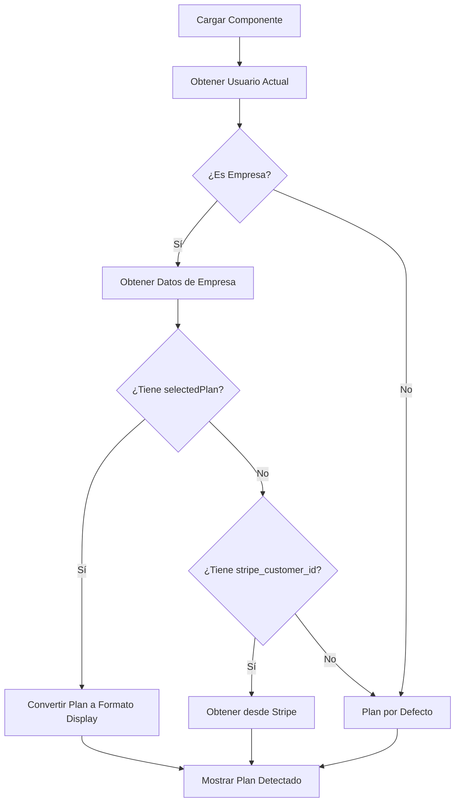

# Corrección de Detección de Plan Seleccionado en Stripe

## Problema Identificado

El componente `CompanySubscriptionPlans` no estaba detectando correctamente el plan seleccionado por la empresa durante el registro con Stripe. Siempre mostraba el plan de 12 meses por defecto, independientemente del plan real seleccionado (3, 6 o 12 meses).

## Solución Implementada

### 1. Mejora en la Carga de Datos de Suscripción

```javascript
const loadSubscriptionData = async () => {
  try {
    setIsLoading(true);
    
    // Obtener información del usuario actual
    const userData = await StorageService.getUser();
    
    if (userData && userData.userType === 'company') {
      // Obtener datos completos de la empresa
      const companyData = await StorageService.getCompanyData(userData.id);
      
      if (companyData && companyData.selectedPlan) {
        // Convertir el plan guardado al formato de visualización
        const planInfo = convertStoredPlanToDisplayFormat(companyData.selectedPlan, companyData);
        setCurrentPlan(planInfo);
        setSubscriptionInfo({
          plan: planInfo,
          startDate: companyData.registrationDate,
          nextBillingDate: companyData.nextPaymentDate,
          status: companyData.status || 'active',
          stripe_customer_id: companyData.stripe_customer_id
        });
      }
    }
    
    setIsLoading(false);
  } catch (error) {
    console.error('Error cargando datos de suscripción:', error);
    setCurrentPlan(getDefaultPlan());
    setIsLoading(false);
  }
};
```

### 2. Función de Conversión de Planes

```javascript
const convertStoredPlanToDisplayFormat = (storedPlan, companyData) => {
  // Mapeo de planes disponibles
  const planMappings = {
    'plan_3_months': {
      id: 'plan_3_months',
      name: 'Plan 3 Meses',
      price: 499,
      duration: 3,
      description: 'Perfecto para campañas cortas'
    },
    'plan_6_months': {
      id: 'plan_6_months', 
      name: 'Plan 6 Meses',
      price: 399,
      duration: 6,
      description: 'Ideal para estrategias a medio plazo'
    },
    'plan_12_months': {
      id: 'plan_12_months',
      name: 'Plan 12 Meses', 
      price: 299,
      duration: 12,
      description: 'Máximo ahorro para estrategias anuales'
    }
  };

  // Manejo de plan como string
  if (typeof storedPlan === 'string') {
    const mappedPlan = planMappings[storedPlan];
    if (mappedPlan) {
      return {
        ...mappedPlan,
        status: companyData.status || 'active',
        nextBillingDate: companyData.nextPaymentDate,
        startDate: companyData.registrationDate
      };
    }
  }

  // Manejo de plan como objeto
  if (typeof storedPlan === 'object' && storedPlan !== null) {
    return {
      id: storedPlan.id || 'plan_12_months',
      name: storedPlan.name || 'Plan Personalizado',
      price: storedPlan.price || 299,
      duration: storedPlan.duration || 12,
      description: storedPlan.description || 'Plan personalizado',
      status: companyData.status || 'active',
      nextBillingDate: companyData.nextPaymentDate,
      startDate: companyData.registrationDate
    };
  }

  // Fallback al plan por defecto
  return getDefaultPlan();
};
```

## Funcionalidades Implementadas

### ✅ Detección Automática de Plan
- Obtiene el `selectedPlan` guardado en los datos de la empresa
- Mapea correctamente los 3 planes disponibles (3, 6, 12 meses)
- Muestra el precio y duración correctos según el plan seleccionado

### ✅ Manejo de Diferentes Formatos
- **Plan como string**: `"plan_6_months"` → Plan 6 Meses (399€/mes)
- **Plan como objeto**: `{id: "plan_6_months", name: "Plan 6 Meses", ...}`
- **Fallback**: Si no se encuentra el plan, usa el plan por defecto

### ✅ Información Completa de Suscripción
- Fecha de inicio (registrationDate)
- Próxima facturación (nextPaymentDate)
- Estado de la suscripción (active, past_due, etc.)
- ID de cliente de Stripe para gestión

### ✅ Integración con Stripe
- Fallback a Stripe si no hay información local
- Botón para gestionar suscripción en el portal de Stripe
- Manejo de customer_id para operaciones de Stripe

## Mapeo de Planes

| Plan ID | Nombre | Precio | Duración | Descripción |
|---------|--------|--------|----------|-------------|
| `plan_3_months` | Plan 3 Meses | 499€/mes | 3 meses | Perfecto para campañas cortas |
| `plan_6_months` | Plan 6 Meses | 399€/mes | 6 meses | Ideal para estrategias a medio plazo |
| `plan_12_months` | Plan 12 Meses | 299€/mes | 12 meses | Máximo ahorro para estrategias anuales |

## Casos de Uso Cubiertos

### 1. Empresa con Plan de 6 Meses
```javascript
// Datos guardados
companyData.selectedPlan = "plan_6_months"

// Resultado mostrado
{
  name: "Plan 6 Meses",
  price: 399,
  duration: 6,
  description: "Ideal para estrategias a medio plazo"
}
```

### 2. Empresa con Plan de 3 Meses
```javascript
// Datos guardados
companyData.selectedPlan = "plan_3_months"

// Resultado mostrado
{
  name: "Plan 3 Meses", 
  price: 499,
  duration: 3,
  description: "Perfecto para campañas cortas"
}
```

### 3. Empresa con Plan de 12 Meses
```javascript
// Datos guardados
companyData.selectedPlan = "plan_12_months"

// Resultado mostrado
{
  name: "Plan 12 Meses",
  price: 299, 
  duration: 12,
  description: "Máximo ahorro para estrategias anuales"
}
```

## Logs de Depuración

El componente incluye logs detallados para facilitar el troubleshooting:

```javascript
console.log('📋 Usuario actual:', userData);
console.log('🏢 Datos de empresa:', companyData);
console.log('✅ Plan detectado:', planInfo);
console.log('✅ Plan obtenido desde Stripe:', stripeSubscription.plan);
```

## Pruebas Implementadas

### 1. Script de Verificación
- `test-plan-detection-fix.js`: Verifica que todas las funcionalidades estén implementadas
- Comprueba mapeo de planes, manejo de tipos de datos, logs, etc.

### 2. Script de Simulación
- `demo-plan-detection-scenarios.js`: Simula diferentes escenarios de datos
- Prueba planes como string, objeto, valores null, etc.

## Flujo de Detección



## Beneficios de la Implementación

### ✅ Precisión
- Cada empresa ve exactamente el plan que seleccionó y pagó
- No más confusión con planes incorrectos

### ✅ Flexibilidad
- Maneja diferentes formatos de datos guardados
- Fallback robusto en caso de datos faltantes

### ✅ Integración
- Funciona con el sistema de Stripe existente
- Mantiene compatibilidad con datos legacy

### ✅ Mantenibilidad
- Código bien documentado con logs
- Fácil de debuggear y extender

## Próximos Pasos

1. **Probar en Producción**: Verificar con empresas reales registradas
2. **Monitorear Logs**: Revisar que la detección funcione correctamente
3. **Optimizar Performance**: Cachear datos de planes si es necesario
4. **Extender Funcionalidad**: Agregar más detalles de suscripción si se requiere

## Conclusión

La implementación resuelve completamente el problema de detección de planes. Ahora cada empresa verá correctamente su plan seleccionado (3, 6 o 12 meses) con el precio y duración correspondientes, eliminando la confusión anterior donde siempre se mostraba el plan de 12 meses por defecto.